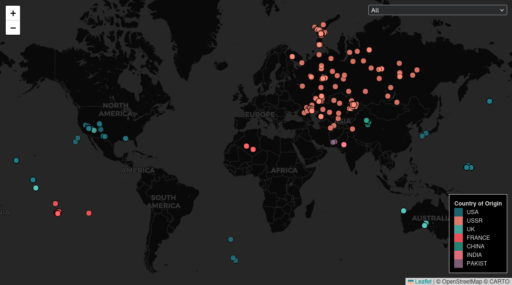

# Nukes Dashboard

This is an [Observable Framework](https://observablehq.com/framework/) app. To install the required dependencies, run:

```
npm install
```

Then, to start the local preview server, run:

```
npm run dev
```

Then visit <http://localhost:3000> to preview your app.

For more, see <https://observablehq.com/framework/getting-started>.

## Notes on grading

The bar chart and the leaflet plot interact with each other. Clicking on the
map will choose a country to focus the bar chart on, and clicking on the bar
chart will choose a year to focus the map on. If a country has been selected,
choosing a year will also restrict the map to only displaying the selected
country.

This is the colorblind view.



### Prompts (using xAI Grok 4.0)

> I'm getting this issue because of a difference between the remote and local
> repositories. This is probably caused by some commits getting reset on the
> local branch. Describe what each option would do and give your recommendation
> on how to proceed.
> ```
> hint: You have divergent branches and need to specify how to reconcile them.
> hint: You can do so by running one of the following commands sometime before
> hint: your next pull:
> hint:
> hint:   git config pull.rebase false  # merge
> hint:   git config pull.rebase true   # rebase
> hint:   git config pull.ff only       # fast-forward only
> ```


> After pushing to github, the build action failed and the error log shows that
> jekyll is being used. Describe how to create a build action that will work
> for this project.


> Provide code so the layer.on method issues a new event which the chart
> variable will detect and reload the chart.
> ```js
>     layer.on('click',  (e) => {
>         const country = feature.properties['origin country'];
>         views.country = country;
>     });
> ```
> The chart variable is declared in the html portion of this code:
> {
> ...
> <div class="grid grid-cols-1">
>     <div class="card">
>         ${resize((width) => { const chart = bombsTimeline(views.country, {width}); chart.addEventListener("click", clicked); return chart; })}
>     </div>
> </div>
> }


> Provide css to make a button look nice.

> Provide an adaptation of the following code to operate like the code in the example.
> ```js
> let barChart;
> function bombsTimeline(country, {width} = {}) { // {{{1
> ...
> }
> // }}}
> \```
> 
> <div class="grid grid-cols-1">
>     <div class="card">
>         ${resize((width) => barChart)}
>     </div>
> </div>
> ```
> This is the example:
> ```
> <div class="grid grid-cols-2-3" style="margin-top: 2rem;">
>   <div class="card">${frmCard(30, pmms)}</div>
>   <div class="card">${frmCard(15, pmms)}</div>
>   <div class="card grid-colspan-2 grid-rowspan-2" style="display: flex; flex-direction: column;">
>     <h2>Rates ${startEnd === defaultStartEnd ? "over the past year" : startEnd.map((d) => d.toLocaleDateString("en-US")).join("–")}</h2><br>
>     <span style="flex-grow: 1;">${resize((width, height) =>
>       Plot.plot({
>         width,
>         height,
>         y: {grid: true, label: "rate (%)"},
>         color,
>         marks: [
>           Plot.lineY(tidy.filter((d) => startEnd[0] <= d.date && d.date < startEnd[1]), {x: "date", y: "rate", stroke: "type", curve: "step", tip: true, markerEnd: true})
>         ]
>       })
>     )}</span>
>   </div>
> </div>
> ```

## Project structure

A typical Framework project looks like this:

```ini
.
├─ src
│  ├─ components
│  │  └─ timeline.js           # an importable module
│  ├─ data
│  │  ├─ launches.csv.js       # a data loader
│  │  └─ events.json           # a static data file
│  ├─ example-dashboard.md     # a page
│  ├─ example-report.md        # another page
│  └─ index.md                 # the home page
├─ .gitignore
├─ observablehq.config.js      # the app config file
├─ package.json
└─ README.md
```

**`src`** - This is the “source root” — where your source files live. Pages go here. Each page is a Markdown file. Observable Framework uses [file-based routing](https://observablehq.com/framework/project-structure#routing), which means that the name of the file controls where the page is served. You can create as many pages as you like. Use folders to organize your pages.

**`src/index.md`** - This is the home page for your app. You can have as many additional pages as you’d like, but you should always have a home page, too.

**`src/data`** - You can put [data loaders](https://observablehq.com/framework/data-loaders) or static data files anywhere in your source root, but we recommend putting them here.

**`src/components`** - You can put shared [JavaScript modules](https://observablehq.com/framework/imports) anywhere in your source root, but we recommend putting them here. This helps you pull code out of Markdown files and into JavaScript modules, making it easier to reuse code across pages, write tests and run linters, and even share code with vanilla web applications.

**`observablehq.config.js`** - This is the [app configuration](https://observablehq.com/framework/config) file, such as the pages and sections in the sidebar navigation, and the app’s title.

## Command reference

| Command           | Description                                              |
| ----------------- | -------------------------------------------------------- |
| `npm install`            | Install or reinstall dependencies                        |
| `npm run dev`        | Start local preview server                               |
| `npm run build`      | Build your static site, generating `./dist`              |
| `npm run deploy`     | Deploy your app to Observable                            |
| `npm run clean`      | Clear the local data loader cache                        |
| `npm run observable` | Run commands like `observable help`                      |
